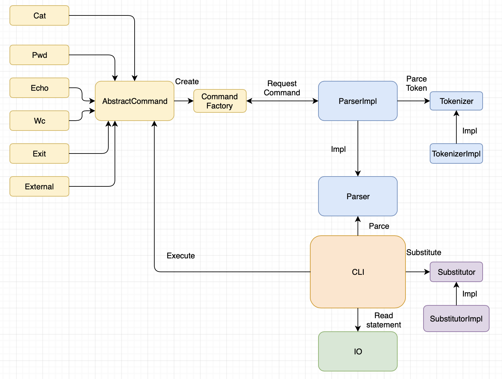

# SoftwareDesign
HW2 GREP  
Для реализации разбора аргументов есть много вариантов, рассматривалось три:
1) pcj/google-options
2) apache commons cli
3) args4j

Первый основан на аннотациях -- это хорошо и лаконично, однако эта библиотека предполагает создание своего класса для набора опций (наследование от OptionsBase, где добавлены нужные аргументы с нужными аннотациями), кроме того она непопулярна, всего около 100 результатов поиска в гите.  

Второй предполагает реализацию без введения отдельного класса, но зато у него нет аннотаций, надо делать через код, что весьма объемно.  

Третий же вариант совмещает плюсы предыдущих: надо просто в классе проаннотировать нужные поля как аргументы команды, поэтому он и был выбран.
HW1 CLI  

## Описание архитектуры:  
Программа состоит из основного класса Main, который инициирует каждый этап работы с выражением. Кроме него, можно выделить 3 логических части: подстановщик переменных из окружения, парсер выражения, и исполнение последовательности команд  

## Описание процесса:  
CLI читает строчку и начинает ее обработку в следующем порядке:  
1) Сначала производится подстановка переменных в необходимых местах с помощью классов Substitutor (делает подстановку, обращаясь к Environment за значениями переменных) и Tokenizer (парсит отдельные части языка в процессе разбора)
2) Полученное выражение передается на разбор классу Parser, который при помощи класса Tokenizer парсит отдельные лексеммы, формируя команды к исполнению (читает имя команды, а также ее аргументы, например, до пайпа или до конца строки). При этом команд может быть много, соединенных через пайплайн, в этой ситуации они складываются в список, который потом превращается в корректную последовательность выполнения всех команд. 
+ Команда -- это сущность, которую можно выполнить. Команда должна быть наследником класса AbstractCommand, который содержит поле для аргументов и абстрактный метод execute, который выполняет команду.
3) Затем у корневой команды происходит исполнение, которое происходит по цепочке, передавая результат исполнения на вход следующей команде.
4) Результатом является класс CommandResult, который содержит в себе следующее: список строчек результата работы, флаг того, была ли команда остановлена (вследствие ошибки) и флаг того, следует ли завершить CLI после исполнения данной косманды (выставляется командой exit)

+ В процессе выполнения всех этапов обработки происходит логгирование в INFO, если это информация об очередном потенциально опасном месте, и в WARNING при ошибке (при исключениях)  
+ Всего есть три вида ошибок при обработке: отсутствие переменной (NoSuchVariable), ошибка разбора (ParseException), ошибка ввода-вывода (FileIOException), и прочие ошибки (CliException), например, при исполнении внешней команды

